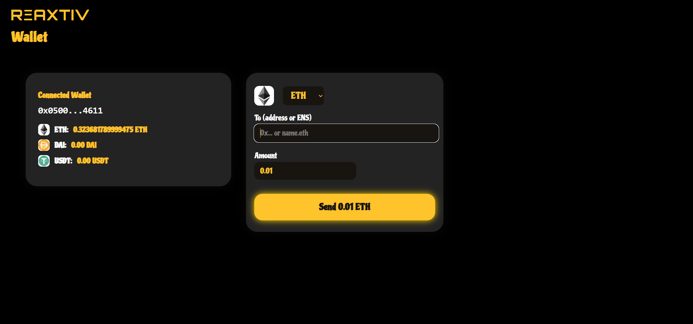

# RΞAXTIV

[](./LICENSE)
[](https://reaxtiv-app.vercel.app/)
[](https://youtu.be/nY59PlghBvY)

>> **RΞAXTIV** is a modern React application that brings together essential Web3 tools into a single, user-friendly interface.  
> With RΞAXTIV, users can seamlessly access decentralized messaging, asset management, and DAO participation without switching between multiple dApps or browser extensions.

<p align="center">
  
</p>


### What is RΞAXTIV?

RΞAXTIV is designed to simplify the Web3 experience for both beginners and advanced users. It acts as a Swiss Army knife for Ethereum and blockchain interactions, combining the most important tools of the decentralized ecosystem into a single, cohesive platform.


### Why use RΞAXTIV?

- **All-in-One:**  
  No more switching between websites or browser tabs. Access messaging, wallet, and DAO voting from one streamlined interface.

- **User-Friendly:**  
  The modern UI is designed for clarity, speed, and accessibility, making it easy for anyone to use Web3 tools.

- **Privacy First:**  
  Messaging and transactions are decentralized and encrypted, giving you full control over your data and assets.

- **Open Source:**  
  RΞAXTIV is open source and community-driven, ensuring transparency, security, and continuous improvement.


Try it now and experience the next generation of Web3 interaction with RΞAXTIV!

## 🚀 Features

### 1. XMTP Messaging (Chat)

Send and receive secure, decentralized messages with any XMTP-compatible wallet. Enjoy a modern chat experience that protects your privacy and makes communication easy in the Web3 environment.


---

### 2. Ethereum & ERC-20 Tools (Ethereum Wallet)

Check the ETH, USDT, and DAI balance of any Ethereum wallet address. Easily and securely send ETH, USDT, and DAI to any Ethereum or ENS address.



---

### 3. Snapshot DAO Integration (DAO Participation)

Browse a curated list of leading DAOs, view and filter recent proposals for each DAO, and access direct links to vote on Snapshot.


### 🦊 MetaMask Integration
- Connect your MetaMask wallet to sign messages, send transactions, and interact with DAOs.

---

## 🎬 Demo Video

[](https://youtu.be/nY59PlghBvY)

---


## 🛠️ Installation

```bash
git clone https://github.com/Reaxtiv/reaxtiv-app.git
cd reaxtiv-app
npm install
```

## ▶️ Usage

[Try the live app!](https://reaxtiv-app.vercel.app/)

Or run locally:

```bash
npm start
```
Open [http://localhost:3000](http://localhost:3000) in your browser.

---

## ⚙️ Configuration

If you use environment variables (`.env`), add them in the root directory of the project.

---

## 📝 License

This project is licensed under the MIT License. See the [LICENSE](./LICENSE) file for details.

---

<p align="center">
  <b>Made with ❤️ by the Reaxtiv Team</b>
</p>
